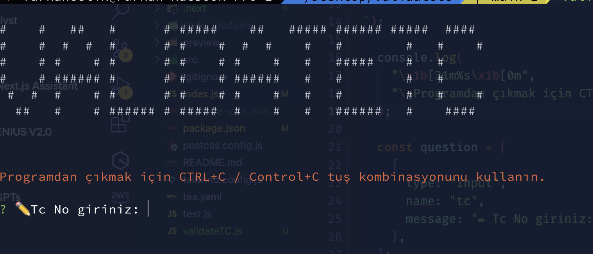

# TC Kimlik Numarası Doğrulayıcı

Bu paket, verilen bir TC kimlik numarasının geçerli olup olmadığını doğrulamak için kullanılır.

## Kurulum

Paketi NPM üzerinden yüklemek için aşağıdaki komutu kullanın:

```bash
npm install validatetc
```

# ValidateTC Package with Next.js Example

Bu README, `validateTC` paketini kullanarak Next.js'de nasıl bir örnek proje kurulacağını adım adım anlatır.

## Kurulum

GitHub reposunu klonladıktan sonra, aşağıdaki adımları takip ederek projeyi lokal ortamınızda çalıştırabilirsiniz:

```bash
git clone https://github.com/furkancelik/validatetc.git
```

**Bağımlılıkları Yükleyin**

Projeyi klonladıktan sonra, terminal üzerinden projenin kök dizinine gidin ve bağımlılıkları yüklemek için aşağıdaki komutu çalıştırın:

```bash
npm install
```

**Geliştirme Sunucusunu Başlatın**

Bağımlılıklar yüklendikten sonra, projeyi geliştirme modunda çalıştırmak için aşağıdaki komutu kullanın:

```bash
npm run dev
```

**Uygulamaya Erişim**

Geliştirme sunucusu başlatıldıktan sonra, tarayıcınızda [`http://localhost:3000`](http://localhost:3000)
adresine giderek uygulamayı görüntüleyebilirsiniz.

**validateTC Paketini Test Etme**

Uygulama çalıştırıldığında, validateTC paketinin nasıl kullanılacağını gösteren bir örnek ile karşılaşacaksınız. Detaylı kullanım örnekleri ve daha fazla bilgi için paketin dökümantasyonuna başvurun.


# Validate-CLI Paketi Kullanım Kılavuzu

Bu README dosyası, `validate-cli` paketinin nasıl kurulup kullanılacağını adım adım anlatmaktadır.

## Adım 1: GitHub Reposunu İndirin

Paketi kullanmaya başlamak için öncelikle `validate-cli` paketinin GitHub reposunu bilgisayarınıza klonlayın veya indirin:

```bash
git clone https://github.com/furkancelik/validatetc.git
```

## Adım 2: Bağımlılıkları Yükleyin

Reponuzu indirdikten sonra, terminalinizi açın ve indirdiğiniz dosyanın bulunduğu dizine gidin. Daha sonra, aşağıdaki komutu çalıştırarak bağımlılıkları yükleyin:

```
npm install
```

Bu komut, paketin çalışması için gerekli olan tüm bağımlılıkları yükleyecektir.

## Adım 3: npm link Komutunu Çalıştırın

Paketi lokal olarak test etmek ve kullanmak için, paketi global bir komut olarak sistemize ekleyin. Bunu yapmak için aşağıdaki komutu kullanın:

```
npm link
```

Bu komut, `validatetc` paketini sistem genelinde erişilebilir hale getirecek ve terminalinizden doğrudan komutu çalıştırmanıza olanak tanıyacaktır.

## Adım 4: Paketi Çalıştırın

Tüm kurulum adımları tamamlandıktan sonra, validate-cli paketini aşağıdaki komutu kullanarak çalıştırabilirsiniz:

```
validatetc
```

Bu komut, validate-cli paketinin kullanıcı arayüzünü başlatacak ve sizden gerekli girdileri isteyecektir.


