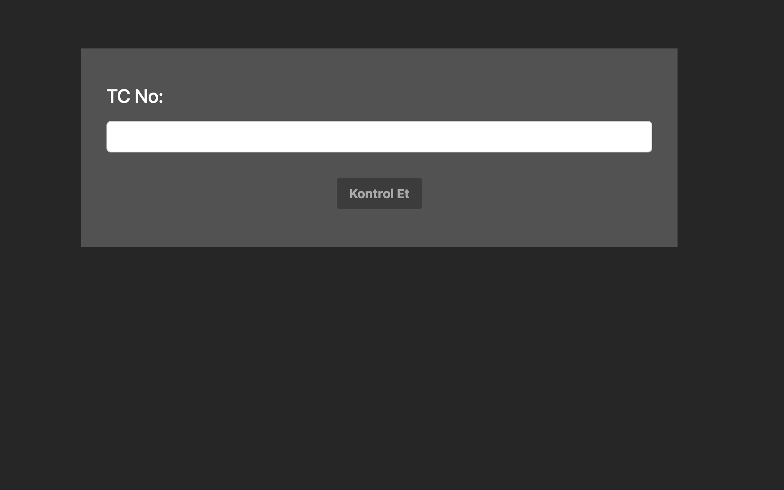

# TC Kimlik Numarası Doğrulayıcı

Bu paket, verilen bir TC kimlik numarasının geçerli olup olmadığını doğrulamak için kullanılır.

## Kurulum

Paketi NPM üzerinden yüklemek için aşağıdaki komutu kullanın:

```bash
npm install validatetc
```

# ValidateTC Package with Next.js Example

Bu README, `validateTC` paketini kullanarak Next.js'de nasıl bir örnek proje kurulacağını adım adım anlatır.

## Kurulum

GitHub reposunu klonladıktan sonra, aşağıdaki adımları takip ederek projeyi lokal ortamınızda çalıştırabilirsiniz:

**Bağımlılıkları Yükleyin**

Projeyi klonladıktan sonra, terminal üzerinden projenin kök dizinine gidin ve bağımlılıkları yüklemek için aşağıdaki komutu çalıştırın:

```bash
npm install
```

**Geliştirme Sunucusunu Başlatın**

Bağımlılıklar yüklendikten sonra, projeyi geliştirme modunda çalıştırmak için aşağıdaki komutu kullanın:

```bash
npm run dev
```

**Uygulamaya Erişim**

Geliştirme sunucusu başlatıldıktan sonra, tarayıcınızda [`http://localhost:3000`](http://localhost:3000)
adresine giderek uygulamayı görüntüleyebilirsiniz.

**validateTC Paketini Test Etme**

Uygulama çalıştırıldığında, validateTC paketinin nasıl kullanılacağını gösteren bir örnek ile karşılaşacaksınız. Detaylı kullanım örnekleri ve daha fazla bilgi için paketin dökümantasyonuna başvurun.


